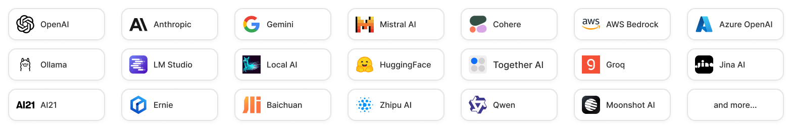

<p>
<a href="https://www.tasking.ai"></a>
</p>

# TaskingAI

<p align="center">
  <a href="https://hub.docker.com/u/taskingai"></a>
  <a href="https://github.com/TaskingAI/TaskingAI/blob/master/LICENSE"></a>
  <a href="https://pypi.org/project/taskingai"></a>
  <a href="https://twitter.com/TaskingAI"></a>
  <a href="https://www.youtube.com/@TaskingAI"></a>
  <a href="https://discord.gg/RqwcD3vG3k"></a>
</p>

<p align="center">
  <a href="./README.md"></a>
  <a href="./i18n/README.de.md"></a>
  <a href="./i18n/README.fr.md"></a>
  <a href="./i18n/README.es.md"></a>
  <a href="./i18n/README.pt.md"></a>
  <a href="./i18n/README.zh-cn.md"></a>
  <a href="./i18n/README.zh-tw.md"></a>
  <a href="./i18n/README.jp.md"></a>
  <a href="./i18n/README.kr.md"></a>
</p>

[TaskingAI](https://www.tasking.ai) is a BaaS (Backend as a Service) platform for **LLM-based Agent Development and Deployment**. It unified the integration of hundreds of LLM models, and provides an intuitive user interface for managing your LLM application's functional modules, including tools, RAG systems, assistants, conversation history, and more.

### Key Features

1. **All-In-One LLM Platform**: Access hundreds of AI models with unified APIs.
2. **Abundant enhancement**: Enhance LLM agent performance with hundreds of customizable built-in **tools** and advanced **Retrieval-Augmented Generation** (RAG) system
3. **BaaS-Inspired Workflow**: Separate AI logic (server-side) from product development (client-side), offering a clear pathway from console-based prototyping to scalable solutions using RESTful APIs and client SDKs.
4. **One-Click to Production**: Deploy your AI agents with a single click to production stage, and scale them with ease. Let TaskingAI handle the rest.
5. **Asynchronous Efficiency**: Harness Python FastAPI's asynchronous features for high-performance, concurrent computation, enhancing the responsiveness and scalability of the applications.
6. **Intuitive UI Console**: Simplifies project management and allows in-console workflow testing.

<p>

</p>

### Integrations

**Models**: TaskingAI connects with hundreds of LLMs from various providers, including OpenAI, Anthropic, and more. We also allow users to integrate local host models through Ollama, LM Studio and Local AI.

<p>

</p>

**Plugins**: TaskingAI supports a wide range of built-in plugins to empower your AI agents, including Google search, website reader, stock market retrieval, and more. Users can also create custom tools to meet their specific needs.

<p>

</p>

---

## Why TaskingAI?

### Problems with existing solutions 🙁

**LangChain** is a tool framework for LLM application development, but it faces practical limitations:

- **Statelessness**: Relies on client-side or external services for data management.
- **Scalability Challenges**: Statelessness impacts consistent data handling across sessions.
- **External Dependencies**: Depends on outside resources like model SDKs and vector storage.

**OpenAI's Assistant API** excels in delivering GPTs-like functionalities but comes with its own constraints:

- **Tied Functionalities**: Integrations like tools and retrievals are tied to each assistant, not suitable for multi-tenant applications.
- **Proprietary Limitations**: Restricted to OpenAI models, unsuitable for diverse needs.
- **Customization Limits**: Users cannot customize agent configuration such as memory and retrieval system.

### How TaskingAI solves the problem 😃

- **Supports both stateful and stateless usages**: Whether to keep track of and manage the message histories and agent conversation sessions, or just make stateless chat completion requests, TaskingAI has them both covered.
- **Decoupled modular management**: Decoupled the management of tools, RAGs systems, language models from the agent. And allows free combination of these modules to build a powerful AI agent.
- **Multi-tenant support**: TaskingAI supports fast deployment after development, and can be used in multi-tenant scenarios. No need to worry about the cloud services, just focus on the AI agent development.
- **Unified API**: TaskingAI provides unified APIs for all the modules, including tools, RAGs systems, language models, and more. Super easy to manage and change the AI agent's configurations.

## What Can You Build with TaskingAI?

- [x] **Interactive Application Demos**
- [x] **AI Agents for Enterprise Productivity**
- [x] **Multi-Tenant AI-Native Applications for Business**

---

Please give us a **FREE STAR 🌟** if you find it helpful 😇

<p>

</p>

---

## Quickstart with Docker

A simple way to initiate self-hosted TaskingAI community edition is through [Docker](https://www.docker.com/).

### Prerequisites

- Docker and Docker Compose installed on your machine.
- Git installed for cloning the repository.
- Python environment (above Python 3.8) for running the client SDK.

### Installation

First, clone the TaskingAI (community edition) repository from GitHub.

```bash
git clone https://github.com/taskingai/taskingai.git
cd taskingai
```

Inside the cloned repository, go to the docker directory.

```bash
cd docker
```

1. **Copy `.env.example` to `.env`**:

   ```sh
   cp .env.example .env
   ```

2. **Edit the `.env` file**:
   Open the `.env` file in your favorite text editor and update the necessary configurations. Ensure all required environment variables are set correctly.

3. **Start Docker Compose**:
   Run the following command to start all services:
   ```sh
   docker-compose -p taskingai --env-file .env up -d
   ```

Once the service is up, access the TaskingAI console through your browser with the URL http://localhost:8080. The default username and password are `admin` and `TaskingAI321`.

### Upgrade

If you have already installed TaskingAI with a previous version and want to upgrade to the latest version, first update the repository.

```bash
git pull origin master
```

Then stop the current docker service, upgrade to the latest version by pulling the latest image, and finally restart the service.

```bash
cd docker
docker-compose -p taskingai down
docker-compose -p taskingai pull
docker-compose -p taskingai --env-file .env up -d
```

Don't worry about data loss; your data will be automatically migrated to the latest version schema if needed.

### TaskingAI UI Console

[](https://youtu.be/4A5uQoawETU)
**_<p style="text-align: center; font-size: small; ">Click the image above to view the TaskingAI Console Demo Video.</p>_**

### TaskingAI Client SDK

Once the console is up, you can programmatically interact with the TaskingAI server using the TaskingAI client SDK.

Ensure you have Python 3.8 or above installed, and set up a virtual environment (optional but recommended).
Install the TaskingAI Python client SDK using pip.

```bash
pip install taskingai
```

Here is a client code example:

```python
import taskingai

taskingai.init(api_key='YOUR_API_KEY', host='http://localhost:8080')

# Create a new assistant
assistant = taskingai.assistant.create_assistant(
    model_id="YOUR_MODEL_ID",
    memory="naive",
)

# Create a new chat
chat = taskingai.assistant.create_chat(
    assistant_id=assistant.assistant_id,
)

# Send a user message
taskingai.assistant.create_message(
    assistant_id=assistant.assistant_id,
    chat_id=chat.chat_id,
    text="Hello!",
)

# generate assistant response
assistant_message = taskingai.assistant.generate_message(
    assistant_id=assistant.assistant_id,
    chat_id=chat.chat_id,
)

print(assistant_message)
```

Note that the `YOUR_API_KEY` and `YOUR_MODEL_ID` should be replaced with the actual API key and chat completion model ID you created in the console.

You can learn more in the [documentation](https://docs.tasking.ai/docs/guide/getting_started/self_hosting/overview).

## Resources

- [Documentation](https://docs.tasking.ai)
- [API Reference](https://docs.tasking.ai/api)
- [Contact Us](https://www.tasking.ai/contact-us)

## Community and Contribution

Please see our [contribution guidelines](./CONTRIBUTING.md) for how to contribute to the project.

Also, we’re excited to announce that TaskingAI now has an official Discord community! 🎊

[Join our Discord server](https://discord.gg/RqwcD3vG3k) to:

    •	💬 Engage in discussions about TaskingAI, share ideas, and provide feedback.
    •	📚 Get support, tips, and best practices from other users and our team.
    •	🚀 Stay updated on the latest news, updates, and feature releases.
    •	🤝 Network with like-minded individuals who are passionate about AI and task automation.

## License and Code of Conduct

TaskingAI is released under a specific [TaskingAI Open Source License](./LICENSE). By contributing to this project, you agree to abide by its terms.

## Support and Contact

For support, please refer to our [documentation](https://docs.tasking.ai) or contact us at [support@tasking.ai](mailto:support@tasking.ai).
