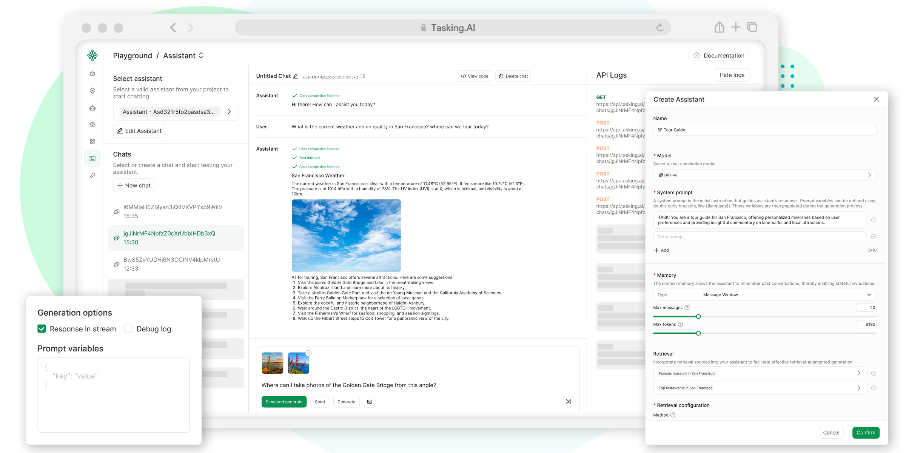

<p>
<a href="https://www.tasking.ai"></a>
</p>

# TaskingAI

<p align="center">
  <a href="https://hub.docker.com/u/taskingai"></a>
  <a href="https://github.com/TaskingAI/TaskingAI/blob/master/LICENSE"></a>
  <a href="https://pypi.org/project/taskingai"></a>
  <a href="https://twitter.com/TaskingAI"></a>
  <a href="https://www.youtube.com/@TaskingAI"></a>
  <a href="https://discord.gg/RqwcD3vG3k"></a>
</p>

<p align="center">
  <a href="../README.md"></a>
  <a href="./README.de.md"></a>
  <a href="./README.fr.md"></a>
  <a href="./README.es.md"></a>
  <a href="./README.pt.md"></a>
  <a href="./README.zh-cn.md"></a>
  <a href="./README.zh-tw.md"></a>
  <a href="./README.jp.md"></a>
  <a href="./README.kr.md"></a>
</p>

[TaskingAI](https://www.tasking.ai) es una plataforma BaaS (Backend as a Service) para el **Desarrollo y Despliegue de Agentes basados en LLM**. Unifica la integración de cientos de modelos LLM y proporciona una interfaz de usuario intuitiva para gestionar los módulos funcionales de tu aplicación LLM, incluyendo herramientas, sistemas RAG, asistentes, historial de conversaciones y más.

### Características Clave

1. **Plataforma LLM Todo-en-Uno**: Accede a cientos de modelos de IA con APIs unificadas.
2. **Abundantes Mejoras**: Mejora el rendimiento del agente LLM con cientos de **herramientas** integradas personalizables y un sistema avanzado de **Generación Aumentada por Recuperación** (RAG).
3. **Flujo de Trabajo Inspirado en BaaS**: Separa la lógica de IA (del lado del servidor) del desarrollo del producto (del lado del cliente), ofreciendo un camino claro desde la creación de prototipos basada en consola hasta soluciones escalables utilizando APIs RESTful y SDKs de cliente.
4. **Despliegue con un Clic**: Despliega tus agentes de IA con un solo clic a la etapa de producción y escálalos fácilmente. Deja que TaskingAI se encargue del resto.
5. **Eficiencia Asíncrona**: Aprovecha las características asíncronas de Python FastAPI para cálculos concurrentes de alto rendimiento, mejorando la capacidad de respuesta y la escalabilidad de las aplicaciones.
6. **Consola UI Intuitiva**: Simplifica la gestión de proyectos y permite pruebas de flujo de trabajo en la consola.

<p>

</p>

### Integraciones

**Modelos**: TaskingAI se conecta con cientos de LLMs de varios proveedores, incluyendo OpenAI, Anthropic y más. También permitimos a los usuarios integrar modelos alojados localmente a través de Ollama, LM Studio y Local AI.

<p>

</p>

**Plugins**: TaskingAI soporta una amplia gama de plugins integrados para potenciar tus agentes de IA, incluyendo búsqueda en Google, lector de sitios web, recuperación de mercado de valores y más. Los usuarios también pueden crear herramientas personalizadas para satisfacer sus necesidades específicas.

<p>

</p>

---

## ¿Por qué TaskingAI?

### Problemas con soluciones existentes 🙁

**LangChain** es un framework de herramientas para el desarrollo de aplicaciones LLM, pero enfrenta limitaciones prácticas:

- **Sin Estado**: Depende de servicios del lado del cliente o externos para la gestión de datos.
- **Desafíos de Escalabilidad**: La ausencia de estado impacta la gestión consistente de datos entre sesiones.
- **Dependencias Externas**: Depende de recursos externos como SDKs de modelos y almacenamiento vectorial.

**API de Asistente de OpenAI** se destaca en la entrega de funcionalidades similares a GPT pero tiene sus propias limitaciones:

- **Funciones Vinculadas**: Las integraciones como herramientas y recuperaciones están vinculadas a cada asistente, no son adecuadas para aplicaciones multiinquilino.
- **Limitaciones Propietarias**: Restringido a modelos OpenAI, inadecuado para necesidades diversas.
- **Límites de Personalización**: Los usuarios no pueden personalizar la configuración del agente como el sistema de memoria y recuperación.

### Cómo TaskingAI soluciona el problema 😃

- **Soporta usos con y sin estado**: Ya sea para llevar un seguimiento y gestionar los historiales de mensajes y sesiones de conversación del agente, o simplemente realizar solicitudes de finalización de chat sin estado, TaskingAI cubre ambas opciones.
- **Gestión Modular Desacoplada**: Desacopla la gestión de herramientas, sistemas RAG, modelos de lenguaje del agente. Y permite la libre combinación de estos módulos para construir un agente de IA potente.
- **Soporte Multiinquilino**: TaskingAI soporta el despliegue rápido después del desarrollo y puede ser usado en escenarios multiinquilino. No te preocupes por los servicios en la nube, solo concéntrate en el desarrollo del agente de IA.
- **API Unificada**: TaskingAI proporciona APIs unificadas para todos los módulos, incluyendo herramientas, sistemas RAG, modelos de lenguaje y más. Súper fácil de gestionar y cambiar las configuraciones del agente de IA.

## ¿Qué puedes construir con TaskingAI?

- [x] **Demos Interactivas de Aplicaciones**
- [x] **Agentes de IA para la Productividad Empresarial**
- [x] **Aplicaciones Nativas Multiinquilino para Negocios**

---

Por favor, déjanos una **ESTRELLA GRATIS 🌟** si lo encuentras útil 😇

<p>

</p>

---

## Inicio rápido con Docker

Una forma sencilla de iniciar la edición comunitaria autohospedada de TaskingAI es a través de [Docker](https://www.docker.com/).

### Requisitos Previos

- Docker y Docker Compose instalados en tu máquina.
- Git instalado para clonar el repositorio.
- Entorno de Python (superior a Python 3.8) para ejecutar el SDK del cliente.

### Instalación

Primero, clona el repositorio de TaskingAI (edición comunitaria) desde GitHub.

```bash
git clone https://github.com/taskingai/taskingai.git
cd taskingai
```

Dentro del repositorio clonado, dirígete al directorio docker y lanza los servicios usando Docker Compose.

```bash
cd docker
```

1. **Copia `.env.example` a `.env`**:

   ```sh
   cp .env.example .env
   ```

2. **Edita el archivo `.env`**:
   Abre el archivo `.env` en tu editor de texto favorito y actualiza las configuraciones necesarias. Asegúrate de que todas las variables de entorno requeridas estén configuradas correctamente.

3. **Inicia Docker Compose**:
   Ejecuta el siguiente comando para iniciar todos los servicios:
   ```sh
   docker-compose -p taskingai --env-file .env up -d
   ```

Una vez que el servicio esté activo, accede a la consola de TaskingAI a través de tu navegador con la URL http://localhost:8080. El nombre de usuario y contraseña predeterminados son `admin` y `TaskingAI321`.

### Actualización

Si ya has instalado TaskingAI con una versión previa y deseas actualizar a la última versión, primero actualiza el repositorio.

```bash
git pull origin master
```

Luego detén el servicio docker actual, actualiza a la última versión obteniendo la última imagen, y finalmente reinicia el servicio.

```bash
cd docker
docker-compose -p taskingai down
docker-compose -p taskingai pull
docker-compose -p taskingai --env-file .env up -d
```

No te preocupes por la pérdida de datos; tus datos se migrarán automáticamente al esquema de la última versión si es necesario.

### Consola UI de TaskingAI

[](https://youtu.be/4A5uQoawETU)

**_<p style="text-align: center; font-size: small; ">Haz clic en la imagen de arriba para ver el video de demostración de la Consola de TaskingAI.</p>_**

### SDK de Cliente de TaskingAI

Una vez que la consola esté en funcionamiento, puedes interactuar programáticamente con el servidor TaskingAI utilizando el SDK de cliente de TaskingAI.

Asegúrate de tener instalado Python 3.8 o superior, y configurar un entorno virtual (opcional pero recomendado).

Instala el SDK de cliente Python de TaskingAI utilizando pip.

```bash
pip install taskingai
```

Aquí hay un ejemplo de código de cliente:

```python
import taskingai
taskingai.init(api_key='YOUR_API_KEY', host='http://localhost:8080')

# Create a new assistant
assistant = taskingai.assistant.create_assistant(
    model_id="YOUR_MODEL_ID",
    memory="naive",
)

# Create a new chat
chat = taskingai.assistant.create_chat(
    assistant_id=assistant.assistant_id,
)

# Send a user message
taskingai.assistant.create_message(
    assistant_id=assistant.assistant_id,
    chat_id=chat.chat_id,
    text="Hello!",
)

# generate assistant response
assistant_message = taskingai.assistant.generate_message(
    assistant_id=assistant.assistant_id,
    chat_id=chat.chat_id,
)
print(assistant_message)
```

Ten en cuenta que `YOUR_API_KEY` y `YOUR_MODEL_ID` deben ser reemplazados por la clave API y el ID del modelo de finalización de chat reales que creaste en la consola.

Puedes aprender más en la [documentación](https://docs.tasking.ai/docs/guide/getting_started/self_hosting/overview).

## Recursos

- [Documentación](https://docs.tasking.ai)
- [Referencia API](https://docs.tasking.ai/api)
- [Contáctanos](https://www.tasking.ai/contact-us)

## Comunidad y Contribución

Por favor, consulte nuestras [directrices de contribución](../CONTRIBUTING.md) para saber cómo contribuir al proyecto.

¡También nos complace anunciar que TaskingAI ahora tiene una comunidad oficial en Discord! 🎊

[Únete a nuestro servidor de Discord](https://discord.gg/RqwcD3vG3k) para:

    • 💬 Participar en discusiones sobre TaskingAI, compartir ideas y proporcionar retroalimentación.
    • 📚 Obtener apoyo, consejos y mejores prácticas de otros usuarios y nuestro equipo.
    • 🚀 Mantenerte actualizado sobre las últimas noticias, actualizaciones y lanzamientos de características.
    • 🤝 Conectar con personas afines apasionadas por la IA y la automatización de tareas.

## Licencia y Código de Conducta

TaskingAI se publica bajo una [Licencia de Código Abierto específica de TaskingAI](../LICENSE). Al contribuir a este proyecto, aceptas cumplir con sus términos.

## Soporte y Contacto

Para soporte, por favor consulta nuestra [documentación](https://docs.tasking.ai) o contáctanos en [support@tasking.ai](mailto:support@tasking.ai).
