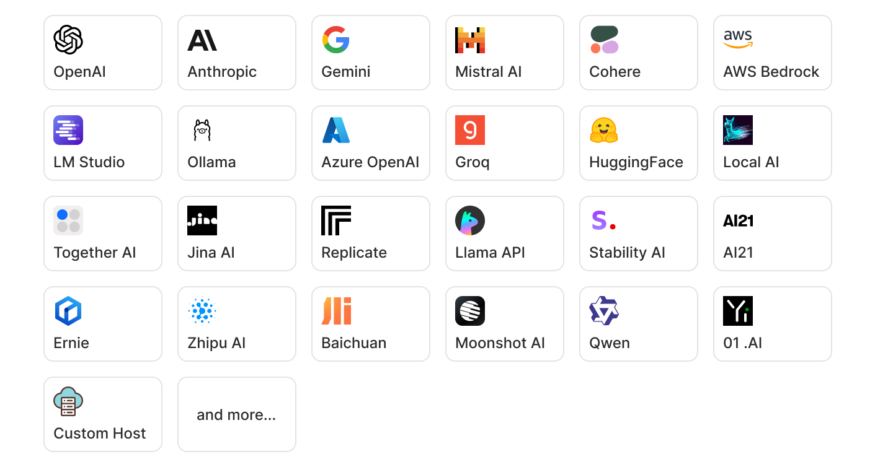

# TaskingAI-Inference: Universal LLM API

[](https://docs.tasking.ai/docs/taskingai-inference/overview)
[](https://docs.tasking.ai/inference-api)
[](https://hub.docker.com/u/taskingai)
[](https://github.com/taskingai/taskingai/blob/master/LICENSE)
[](https://twitter.com/TaskingAI)
[](https://www.youtube.com/@TaskingAI)

**TaskingAI-Inference** is a backend service featuring **a Unified API** aimed at facilitating the smooth integration of Large Language Models (LLMs) and Text Embedding models from various providers. It acts as a bridge, enabling users to effortlessly access and utilize an extensive selection of LLMs. This service employs asynchronous techniques to ensure efficient and high-performance LLM inference.

**Key Features**

1. **Unified API Integration:** Offers seamless integration of a variety of mainstream Large Language Models (LLMs) into the TaskingAI platform through unified APIs, enabling easy access and deployment.

2. **Function Call Support**: Enables LLMs to interact with external resources through supported function calls, expanding their usability and integration capabilities.

3. **Asynchronous Requests for High-Concurrency**: Designed to handle high-concurrency scenarios efficiently through
   the support of asynchronous requests, ensuring performance stability.

4. **End-to-End Encryption**: Ensures the security of data and API keys with robust end-to-end AES encryption,
   safeguarding credential information.

5. **Custom Hosted Model Support**: Allows users to deploy custom models locally and integrate them into the
   TaskingAI-Inference service for seamless access and deployment.

## Model Compatibility

<p>

</p>

The service supports **chat completion** and **text embedding** models from various providers.
Please learn more about model details in the [documentation](https://docs.tasking.ai/docs/guide/model/overview).

## Quickstart with Docker

### Prerequisites

- Docker and Docker Compose installed on your machine.
- Git installed for cloning the repository.
- Curl or other HTTP client installed for testing and debugging.

### Installation

A simple way to initiate self-hosted TaskingAI-Inference service is through [Docker](https://www.docker.com/).

Pull the latest Docker image `taskingai/taskingai-inference:latest` from Docker Hub (or the appropriate registry) by
executing the following command in your terminal:

```bash
docker pull taskingai/taskingai-inference:latest
```

Then, you can run a new container using the following command:

```bash
docker run -d -p 8002:8000 taskingai/taskingai-inference:latest
```

## Running through Source Code

First download the TaskingAI GitHub repository with:

```bash
git clone https://github.com/TaskingAI/TaskingAI.git
cd TaskingAI/inference
```

Install the required Python packages:

```bash
pip install -r requirements.txt
```

Copy the `.env.example` file to `.env` and fill in the required environment variables, including necessary model provider credentials. By default, we set `SERVICE_PORT` to 8002.

```bash
cp .env.example .env
```

Then, you can run the service using the following command:

```bash
PYTHONPATH=$(pwd) python app/main.py
```

Your TaskingAI-Inference is now running on http://localhost:8002.

## Usage

Once deployed, use tools like cURL, Postman, or any HTTP client that allows you to send requests to your local
TaskingAI-Inference service for testing and debugging.

### List Available Models

First, you can list the available models by sending a GET request to the `/v1/model_schemas` endpoint.

```bash
curl "http://localhost:8002/v1/model_schemas"
```

It will return a list of available models and their details.

### Chat Completion

Here's an example of requesting OpenAI's GPT-4 model to carry out a chat completion job through TaskingAI-Inference.
Please replace `$OPENAI_API_KEY` with the actual API key.

```bash
curl "http://localhost:8002/v1/chat_completion" \
-X POST \
-H "Content-Type: application/json" \
-d '{
    "model_schema_id": "openai/gpt-4",
    "credentials": {
      "OPENAI_API_KEY": "$OPENAI_API_KEY"
    },
    "stream": false,
    "configs": {
      "temperature": 0.8
    },
    "messages": [
        {
            "role": "user",
            "content": "What is machine learning?"
        }
    ]
}'
```

Note that `$OPENAI_API_KEY` is an environment variable that stores your OpenAI API key. You can replace it with your actual API key.

You can explore the API reference in http://localhost:8002/redoc. For more usage details, please refer to the [documentation](https://docs.tasking.ai/docs/taskingai-inference/overview).

## Resources

- [TaskingAI](https://github.com/TaskingAI/TaskingAI)
- [Documentation](https://docs.tasking.ai/docs/taskingai-inference/overview)
- [API-Reference](https://docs.tasking.ai/inference-api)
- [Support and Contact](mailto:support@tasking.ai)
