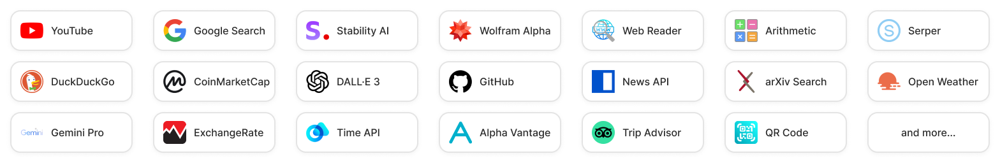

# TaskingAI-Plugin: Friendly Tools for LLMs

[](https://docs.tasking.ai/docs/integration/bundles-and-plugins/overview)
[](https://hub.docker.com/r/taskingai/taskingai-plugin)
[](https://github.com/TaskingAI/TaskingAI/blob/master/LICENSE)
[](https://twitter.com/TaskingAI)
[](https://www.youtube.com/@TaskingAI)

Tasking AI Plugin is part of the TaskingAI platform, an open-source platform for AI-native application development.
Through a unified API, the Plugin service provides a set of tools and utilities to enhance the performance of LLM-based applications.

<p>

</p>

For a full list of integrations, please refer to the [official documentation](https://docs.tasking.ai/docs/integration/bundles-and-plugins/overview).

## Key Features

1. **Unified API**: Access hundreds of useful plugins through one API.
2. **Asynchronous Requests for High-Concurrency**: Designed to handle high-concurrency scenarios efficiently through
   the support of asynchronous requests, ensuring performance stability.
3. **End-to-End Encryption**: Ensures the security of data and API keys with robust end-to-end AES encryption,
   safeguarding credential information.

## Quickstart with Docker

### Prerequisites

- Docker and Docker Compose installed on your machine.
- Git installed for cloning the repository.
- Curl or other HTTP client installed for testing and debugging.

### Installation

A simple way to initiate a self-hosted TaskingAI-Plugin service is through [Docker](https://www.docker.com/).

Pull the latest Docker image `taskingai/taskingai-plugin:latest` from Docker Hub (or the appropriate registry) by executing the following command in your terminal:

```bash
docker pull taskingai/taskingai-plugin:latest
```

Then, you can run a new container using the following command:

```bash
docker run -d -p 8003:8000 taskingai/taskingai-plugin:latest
```

## Running through Source Code

First, download the TaskingAI GitHub repository with:

```bash
git clone https://github.com/TaskingAI/TaskingAI.git
cd TaskingAI/plugin
```

Then, install the required dependencies using:

```bash
pip install -r requirements.txt
```

Copy the `.env.example` file to `.env` and fill in the required environment variables, including object storage configurations (`s3` or `local`) and necessary plugin credentials. We set `SERVICE_PORT` to 8003 by default.

```bash
cp .env.example .env
```

Finally, run the service using:

```bash
PYTHONPATH=$(pwd) python app/main.py
```

## Usage

Once deployed, use tools like cURL, Postman, or any HTTP client to send requests to your local TaskingAI-Plugin service for testing and debugging.

Here's an example of requesting the CoinMarketCap API to get the latest Bitcoin price:

```bash
curl --location 'http://127.0.0.1:8003/v1/execute' \
--header 'Content-Type: application/json' \
--data '{
    "bundle_id": "coin_market_cap",
    "plugin_id": "get_latest_coin_data",
    "input_params": {
        "symbol": "BTC"
    },
    "credentials": {
        "COIN_MARKET_CAP_API_KEY":"YOUR_COIN_MARKET_CAP_API_KEY"
    }
}'
```

You may check the supported bundles and the plugins under each bundle by sending a GET request to the `/v1/bundles` and `/v1/plugins?bundle_id={QUERY_BUNDLE_ID}` endpoints, respectively.

You can explore the API reference in http://localhost:8003/redoc. For more usage details, please refer to the [documentation](https://docs.tasking.ai/docs/integration/bundles-and-plugins/overview)
